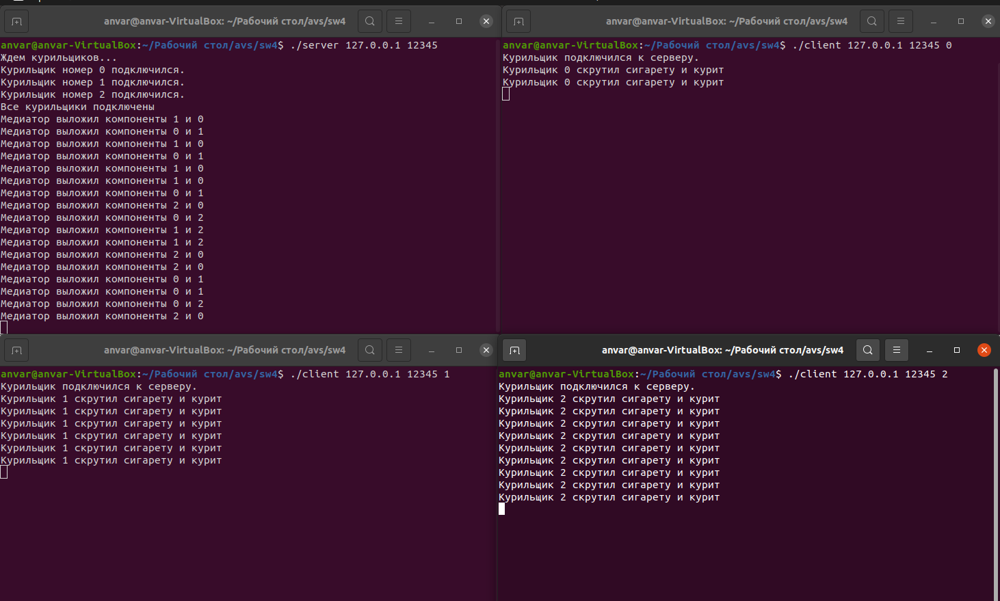
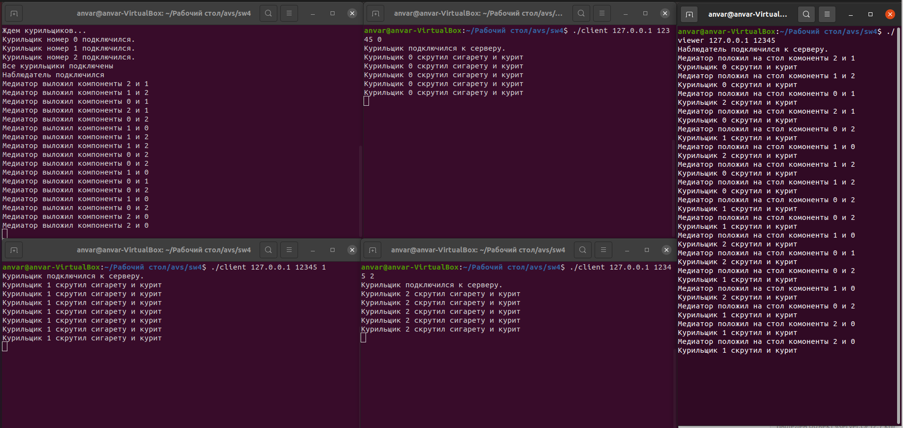

# Self Work 4

## Хасанов Анвар, БПИ216, Вариант 7

## Условие задачи:

```
Задача о курильщиках. Есть три процесса–курильщика и один
процесс–посредник. Курильщик непрерывно скручивает сигареты
и курит их. Чтобы скрутить сигарету, нужны табак, бумага и спички. 
У одного процесса–курильщика есть табак, у второго — бумага,
а у третьего — спички. Посредник кладет на стол по два разных
случайных компонента. Тот процесс–курильщик, у которого есть
третий компонент, забирает компоненты со стола, скручивает сигарету и курит. 
Посредник дожидается, пока курильщик закончит, затем процесс повторяется
```

Работа по критериям сделана на 7 баллов. Коды всех программ можно найти ниже в отчете и выше в самих файлах.

## Принцип работы программы

Для начала создается сервер по указанному IP и порту. Далее к серверу подключаются три клиента. Это три типа курильщиков (у одного только бумага, у другого только спички, у третьего только табак). В дополнении к ним (на 6-7 баллов) подключается и наблюдатель.

Сервер ждет подключения всех клиентов. Далее он генерирует рандомный набор из двух компонент (бумага, спички или табак). После генерации сервер отправляет два числа всем клиентам. Курильщик с нужным недостающим компонентом выводит в консоль, что у него есть полный набор и он может начинать курить.

Для упрощения вывода данных компоненты сигареты обозначаются числами:

0 - табак

1 - бумага

2 - спички

## Результаты работы программы на 4-5 баллов



Видим, что сначала запускаем сервер, потом подключаем к нему клиентов (курильщиков). Сервер выводит сообщения о том, что к нему кто-то подключился. После подключения всех курильщиков, медиатор начинает выкладывать компоненты. Курильщик с полным набором начинает курить. Так происходит бесконечно.

[Код сервера - медиатора](4_5/server.c)
<details>
  <summary>Раскрыть</summary>
    
    ```c
    #include <arpa/inet.h>
    #include <netinet/in.h>
    #include <stdio.h>
    #include <stdlib.h>
    #include <string.h>
    #include <sys/socket.h>
    #include <time.h>
    #include <unistd.h>

    int main(int argc, char *argv[]) {
      if (argc != 3) {
        fprintf(stderr, "Неверные аргументы: %s <ip> <port>\n", argv[0]);
        exit(EXIT_FAILURE);
      }

      int sockfd = socket(AF_INET, SOCK_DGRAM, IPPROTO_UDP);
      if (sockfd == -1) {
        perror("socket");
        exit(EXIT_FAILURE);
      }

      struct sockaddr_in server_addr;
      memset(&server_addr, 0, sizeof(server_addr));
      server_addr.sin_family = AF_INET;
      server_addr.sin_port = htons(atoi(argv[2]));
      if (inet_pton(AF_INET, argv[1], &server_addr.sin_addr.s_addr) <= 0) {
        perror("inet_pton");
        exit(EXIT_FAILURE);
      }

      if (bind(sockfd, (struct sockaddr *)&server_addr, sizeof(server_addr)) == -1) {
        perror("bind");
        exit(EXIT_FAILURE);
      }

      srand(time(NULL));

      while (1) {
        int num1 = rand() % 3;
        int num2;
        do {
          num2 = rand() % 3;
        } while (num1 == num2);

        uint8_t buffer[2] = {num1, num2};
        struct sockaddr_in client_addr;
        socklen_t client_addr_size = sizeof(client_addr);
        int recv_len = recvfrom(sockfd, &client_addr, sizeof(client_addr), 0, (struct sockaddr *)&client_addr, &client_addr_size);
        printf("Медиатор выложил компоненты %d и %d\n", num1, num2);
        if (recv_len == -1) {
          perror("recvfrom");
          exit(EXIT_FAILURE);
        }
        if (sendto(sockfd, buffer, sizeof(buffer), 0, (struct sockaddr *)&client_addr, client_addr_size) == -1) {
          perror("sendto");
          exit(EXIT_FAILURE);
        }
        sleep(1);
      }
      close(sockfd);
      return 0;
    }
    ```
</details>
    
[Код клиента - курильщика](4_5/client.c)
<details>
  <summary>Раскрыть</summary>
    
    ```c
    #include <arpa/inet.h>
    #include <netinet/in.h>
    #include <stdio.h>
    #include <stdlib.h>
    #include <string.h>
    #include <sys/socket.h>
    #include <unistd.h>

    int main(int argc, char *argv[]) {
      if (argc != 4) {
        fprintf(stderr, "Неверные аргументы: %s <ip> <port> <number>\n", argv[0]);
        exit(EXIT_FAILURE);
      }

      int my_number = atoi(argv[3]);

      int sockfd = socket(AF_INET, SOCK_DGRAM, IPPROTO_UDP);
      if (sockfd == -1) {
        perror("socket");
        exit(EXIT_FAILURE);
      }

      struct sockaddr_in server_addr;
      memset(&server_addr, 0, sizeof(server_addr));
      server_addr.sin_family = AF_INET;
      server_addr.sin_port = htons(atoi(argv[2]));
      if (inet_pton(AF_INET, argv[1], &server_addr.sin_addr.s_addr) <= 0) {
        perror("inet_pton");
        exit(EXIT_FAILURE);
      }

      while (1) {
        uint8_t buffer[2] = {0};
        if (sendto(sockfd, buffer, sizeof(buffer), 0, (struct sockaddr *)&server_addr, sizeof(server_addr)) == -1) {
          perror("sendto");
          exit(EXIT_FAILURE);
        }
        int recv_len = recvfrom(sockfd, buffer, sizeof(buffer), 0, NULL, NULL);
        if (recv_len == -1) {
          perror("recvfrom");
          exit(EXIT_FAILURE);
        }
        int missing_number = -1;
        for (int i = 0; i < 3; ++i) {
          if (i != buffer[0] && i != buffer[1]) {
            missing_number = i;
            break;
          }
        }
        if (my_number == missing_number) {
          printf("Курильщик %d скрутил сигарету и курит\n", missing_number);
        }
        sleep(1);
      }
      close(sockfd);
      return 0;
    }
    ```
</details>

## Резульатат работы программы на 6-7 баллов



Здесь логика с курильщиками аналогична предыдущему пункту. Меняется код клиента и добавляется новый клиент - наблюдатель.

После запуска всех приложений наблюдатель будет выводить в консоль сообщения о данных, которые передаются между сервером и клиентами.

[Измененный код клиента](6_7/client.c)
<details>
  <summary>Раскрыть</summary> 
    
    ```c
    #include <arpa/inet.h>
    #include <netinet/in.h>
    #include <stdio.h>
    #include <stdlib.h>
    #include <string.h>
    #include <sys/socket.h>
    #include <unistd.h>

    void send_to_observer(int observer_sockfd, struct sockaddr_in *observer_addr, const char *msg) {
      if (sendto(observer_sockfd, msg, strlen(msg), 0, (struct sockaddr *)observer_addr, sizeof(*observer_addr)) == -1) {
        perror("send to observer");
      }
    }

    int main(int argc, char *argv[]) {
      if (argc != 4) {
        fprintf(stderr, "Неверные аргументы: %s <ip> <port> <number>\n", argv[0]);
        exit(EXIT_FAILURE);
      }

      int my_number = atoi(argv[3]);

      int sockfd = socket(AF_INET, SOCK_DGRAM, IPPROTO_UDP);
      if (sockfd == -1) {
        perror("socket");
        exit(EXIT_FAILURE);
      }

      struct sockaddr_in server_addr;
      memset(&server_addr, 0, sizeof(server_addr));
      server_addr.sin_family = AF_INET;
      server_addr.sin_port = htons(atoi(argv[2]));
      if (inet_pton(AF_INET, argv[1], &server_addr.sin_addr.s_addr) <= 0) {
        perror("inet_pton");
        exit(EXIT_FAILURE);
      }

      while (1) {
        uint8_t buffer[2] = {0};
        if (sendto(sockfd, buffer, sizeof(buffer), 0, (struct sockaddr *)&server_addr, sizeof(server_addr)) == -1) {
          perror("sendto");
          exit(EXIT_FAILURE);
        }
        int recv_len = recvfrom(sockfd, buffer, sizeof(buffer), 0, NULL, NULL);
        if (recv_len == -1) {
          perror("recvfrom");
          exit(EXIT_FAILURE);
        }
        int missing_number = -1;
        for (int i = 0; i < 3; ++i) {
          if (i != buffer[0] && i != buffer[1]) {
            missing_number = i;
            break;
          }
        }
        if (my_number == missing_number) {
          char msg[256];
          snprintf(msg, sizeof(msg), "Курильщик %d скрутил сигарету и курит\n", my_number);
          printf("%s\n", msg);
          send_to_observer(observer_sockfd, &observer_addr, msg);
        }
        sleep(1);
      }
      close(sockfd);
      return 0;
    }
    ```
</details>
  
[Код наблюдателя](6_7/viewer.c)
<details>
  <summary>Раскрыть</summary>
    
    ```c
    #include <arpa/inet.h>
    #include <netinet/in.h>
    #include <stdio.h>
    #include <stdlib.h>
    #include <string.h>
    #include <sys/socket.h>
    #include <unistd.h>

    int main(int argc, char *argv[]) {
      if (argc != 3) {
        fprintf(stderr, "Неверные аргументы: %s <ip> <port>\n", argv[0]);
        exit(EXIT_FAILURE);
      }

      int sockfd = socket(AF_INET, SOCK_DGRAM, IPPROTO_UDP);
      if (sockfd == -1) {
        perror("socket");
        exit(EXIT_FAILURE);
      }

      struct sockaddr_in observer_addr;
      memset(&observer_addr, 0, sizeof(observer_addr));
      observer_addr.sin_family = AF_INET;
      observer_addr.sin_port = htons(atoi(argv[2]));
      if (inet_pton(AF_INET, argv[1], &observer_addr.sin_addr.s_addr) <= 0) {
        perror("inet_pton");
        exit(EXIT_FAILURE);
      }

      if (bind(sockfd, (struct sockaddr *)&observer_addr, sizeof(observer_addr)) == -1) {
        perror("bind");
        exit(EXIT_FAILURE);
      }

      printf("Наблюдатель подключился к серверу.\n");

      while (1) {
        char buffer[256] = {0};
        struct sockaddr_in sender_addr;
        socklen_t sender_addr_size = sizeof(sender_addr);
        int recv_len = recvfrom(sockfd, buffer, sizeof(buffer), 0, (struct sockaddr *)&sender_addr, &sender_addr_size);
        if (recv_len == -1) {
          perror("recvfrom");
          exit(EXIT_FAILURE);
        }
      }

      close(sockfd);
      return 0;
    }
    ```
</details>
    

## Тестирование

Данная программа не подразумевает тестовые данные, поэтому можно посмотреть на вывод в консоль
